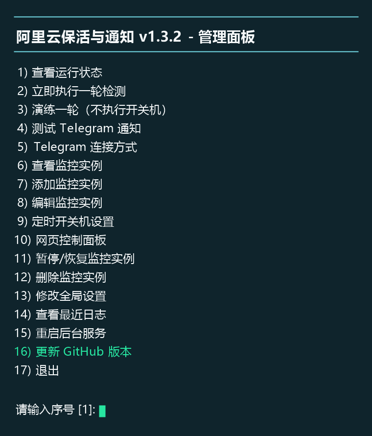
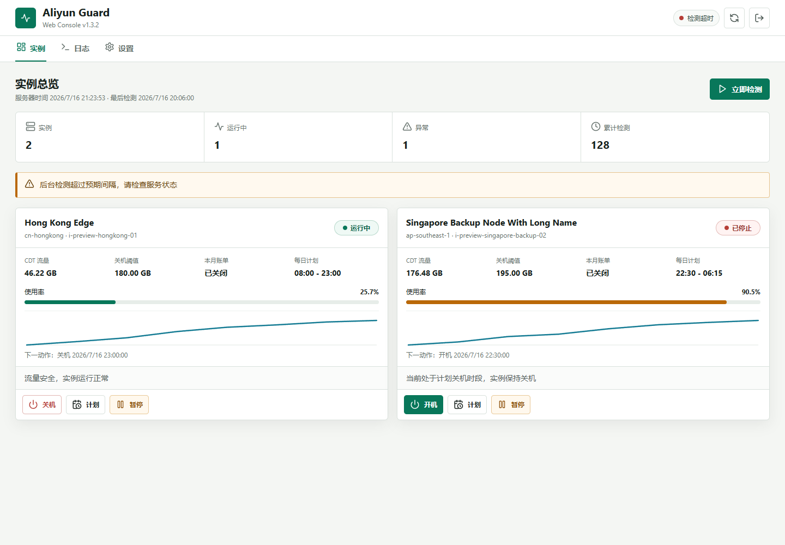
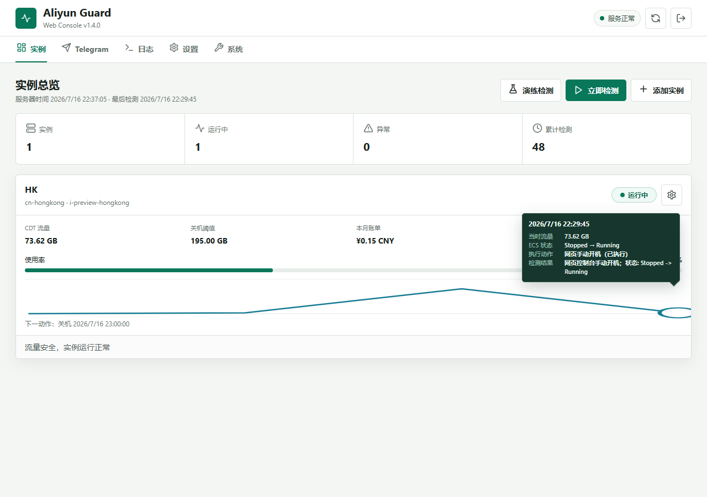
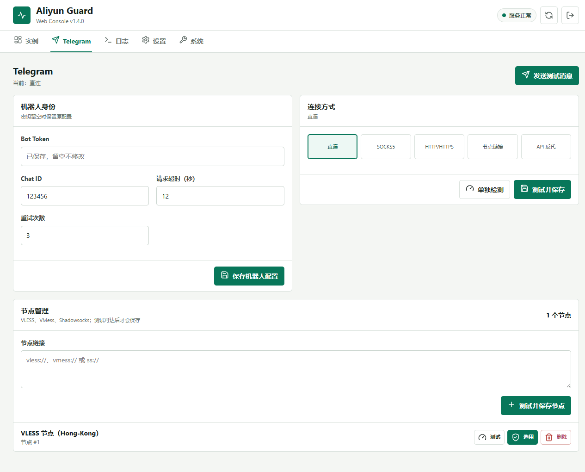

# Aliyun Guard：阿里云 CDT 流量保活、自动止损与账单通知


Aliyun Guard 是一个面向阿里云 ECS 的网页与终端守护工具。它定时查询账号当月 CDT 公网流量、ECS 状态和当前实例税前账单，在计划运行时段且流量安全时确保实例运行，达到阈值或进入计划关机时段后自动关机，并在每轮检测结束后发送 Telegram 汇总。

本项目参考了 [10000ge10000/aliyun_monitor](https://github.com/10000ge10000/aliyun_monitor) 的核心思路，并借鉴 [wang4386/CDT-Monitor](https://github.com/wang4386/CDT-Monitor) 的按实例每日开关机面板设计。项目针对实际部署中遇到的安装兼容、通知缺失、账单 Endpoint 混用、错误来源不清晰和更新困难等问题进行了独立重写。

## 核心能力

- **CDT 流量止损**：流量达到设定阈值后停止 ECS，防止继续产生公网流量。
- **自动保活恢复**：流量低于阈值而实例处于 `Stopped` 时自动启动；次月 CDT 重置后可自动恢复。
- **每日定时开关机**：每个实例可独立设置 `HH:MM` 开机和关机时间，支持跨午夜时段、下一动作预览和服务离线后的补偿执行。
- **完整网页控制台**：终端管理面板的检测、演练、实例增删改查、Telegram 与节点、全局设置、服务重启和 GitHub 更新均可在网页完成。
- **可解释流量趋势**：悬停、键盘聚焦或触摸折线检测点，可查看检测时间、当时流量、ECS 状态变化、执行动作和检测结果。
- **国内站与国际站账单**：分别支持人民币和美元账单 Endpoint，也允许自定义 BSS Endpoint。
- **错误来源分离**：CDT、ECS、BSS 和 Telegram 分别记录结果；账单失败不会阻断保活判断。
- **每轮 Telegram 汇总**：默认每轮都通知，也可切换为仅事件或仅错误通知；临时网络失败自动重试。
- **Telegram 多连接方式**：支持直连、SOCKS5、HTTP/HTTPS、API 反向代理，以及保存、切换多个 VLESS、VMess、Shadowsocks 单节点链接。
- **通知标明代理节点**：使用代理时，每条 Bot 通知都会显示脱敏后的代理端点或节点备注。
- **Telegram 路径延迟测试**：按当前连接方式向 Telegram Bot API 发起 3 次请求，并在终端和测试通知中显示平均往返延迟。
- **多账号、多地域、多实例**：每个实例可使用独立 AccessKey、Region、阈值和账单站点。
- **单实例独立日志**：可为指定实例单独启用日志，周期检测与网页手动开关机按实例隔离记录。
- **交互式管理面板**：增删改、暂停/恢复、立即检测、演练、日志、服务管理和 GitHub 更新均可在菜单完成。
- **多发行版安装**：兼容 `apt`、`dnf`、`yum`、`apk`、`pacman` 和 `zypper`。
- **多调度后端**：优先使用 systemd，其次 OpenRC；无 init 服务时自动回退到 cron。
- **Docker / Compose**：提供可直接构建的镜像、交互式首次配置、公网 IP 访问、数据卷持久化和容器专用重启/更新提示。
- **安全更新**：更新前校验 GitHub `install.sh.sha256`，保留配置、状态和日志后重启服务。
- **启动检查版本**：每次打开管理面板都会读取上游 `version.json`；发现新版时在更新菜单旁显示目标版本。
- **并发保护**：检测任务带文件锁，避免后台巡检与手动执行重叠。
- **凭据保护**：Token、AccessKey 不写入日志，配置文件权限固定为 `600`。

## 保活逻辑

每个未暂停的实例会依次执行以下只读查询：

1. `ListCdtInternetTraffic`：查询 AccessKey 所属账号当月 CDT 总流量。
2. `DescribeInstances`：查询目标 Region 中指定 ECS 的状态。
3. `DescribeInstanceBill`：查询当前月份、当前 ECS 实例的税前账单。

查询完成后按以下规则决策：

| CDT 流量 | ECS 状态 | 自动操作 |
|---|---|---|
| 低于阈值 | `Running` | 保持运行 |
| 低于阈值 | `Stopped` | 调用 `StartInstance` 并等待状态确认 |
| 达到或超过阈值 | `Running` | 调用 `StopInstance` 并等待状态确认 |
| 达到或超过阈值 | `Stopped` | 保持关机 |
| 任意 | `Starting` / `Stopping` | 本轮不重复操作 |

启用每日计划后，计划时段会进一步约束上述保活规则：

- 处于计划关机时段时，实例会保持关机；即使 CDT 或 BSS 临时查询失败，只要 ECS 状态可读取，计划关机仍会执行。
- 进入计划运行时段时，只有 CDT 流量低于阈值才允许开机；流量达到阈值时保持关机。
- 后台每分钟轻量检查一次计划边界，完整 CDT、ECS、BSS 查询仍按“检测间隔”执行。
- 服务在计划边界暂时离线时，恢复后会比较当前目标时段并补偿执行，不要求刚好在整分钟在线。

> CDT 返回的是账号级总流量，不是单台 ECS 的独立流量。同一 AccessKey 下配置多台实例时，它们读取到相同流量，但可以设置不同关机阈值。同一轮检测中，使用相同 AccessKey ID 和 AccessKey Secret 的实例只会请求一次 CDT API，查询结果或错误会在该账号的实例间复用；不同凭据不会合并。

> BSS 账单查询完全独立。即使出现 `NoPermission`、`InvalidAccessKeyId.NotFound` 或 Endpoint 错误，CDT 与 ECS 查询成功后仍会继续执行保活决策，并把账单错误写入 Telegram 汇总。

## 终端管理面板

安装完成后不会自动打开配置或管理界面。请返回命令行，手动输入完整命令 `aliyun-guard`，或输入快捷命令 `ag`。首次打开会先进入配置向导，配置成功后再显示管理面板：

<div align="center">
  
</div>

管理面板包含：

```text
 1) 查看运行状态
 2) 立即执行一轮检测
 3) 演练一轮（不执行开关机）
 4) 测试 Telegram 通知
 5) Telegram 连接方式
 6) 查看监控实例
 7) 添加监控实例
 8) 编辑监控实例
 9) 定时开关机设置
10) 网页控制面板
11) 暂停/恢复监控实例
12) 删除监控实例
13) 修改全局设置
14) 查看最近日志
15) 重启后台服务
16) 更新 GitHub 版本  [有新版本 v1.5.1]  # 仅发现更新时显示提示
17) 退出
```

面板标题始终显示当前版本号，例如 `阿里云保活与通知 v1.5.1 - 管理面板`。发现更新时，标题下方和第 16 项会显示黄色的新版本提示；启动检查超时或 GitHub 暂时不可用不会阻塞其他管理操作，也不会自动安装更新。设置 `NO_COLOR=1` 或将输出重定向到文件时，提示会自动退回纯文本。

这里的交互操作位于服务器终端。当前版本的 Telegram Bot 只发送通知，不读取 `/status`、`/start`、`/stop` 等远程控制命令。

## 网页控制面板

<div align="center">
  
</div>

网页面板包含五个独立视图：

- **实例**：查看 CDT 趋势、ECS、BSS 账单、每日计划和下一动作；每张实例卡右上角都有独立单机设置入口，集中执行开关机、计划、暂停恢复、编辑、校验、查看独立日志和删除。
- **Telegram**：修改 Bot Token、Chat ID、超时和重试；测试当前通知；配置直连、SOCKS5、HTTP/HTTPS、节点链接或 API 反代；添加、测试、选用和删除多个节点。
- **日志**：在系统总日志与各实例独立日志之间切换，可直接启用或停用所选实例日志。
- **设置**：修改全部检测参数、通知模式、IPv4 策略、网页用户名、密码、监听地址和端口。
- **系统**：查看调度后端、本机 IP、访问地址和版本，重启后台服务，并检查或安装 GitHub 新版本。

流量折线不再只是静态图。把鼠标移到检测点上，或用键盘聚焦、在触摸屏点按，即可看到该轮的检测时间、流量、ECS 检测前后状态、实际执行动作和检测结果；没有执行开关机时明确显示“仅检测，无动作”。旧版 `state.json` 中缺少动作字段的历史样本会自动按只读旧数据兼容。

<div align="center">
  
</div>

桌面按可用空间排列实例和设置面板；只有一个实例时会占满整行。手机自动切换为单列，单机操作收纳在右上角设置菜单中，不出现半截按钮或页面横向溢出。

<div align="center">
  
</div>

在终端执行 `aliyun-guard`，选择 `10) 网页控制面板`，设置用户名、至少 8 位的密码、监听方式和端口。密码仅以 PBKDF2-SHA256 哈希形式保存在权限为 `600` 的 `config.json` 中。

默认选择“仅本机”监听：

```sh
ssh -L 8765:127.0.0.1:8765 root@服务器IP
```

随后在本机浏览器打开：

```text
http://127.0.0.1:8765
```

也可以在设置中选择监听 `0.0.0.0`。保存后程序会自动检测本机出口 IPv4，并直接显示完整浏览器地址；检测不到时才显示 `http://服务器IP:8765`。HTTP 直连和 HTTPS 反向代理可以同时使用：程序会按当前访问协议分别签发普通 Cookie 与 `Secure` Cookie，两种登录会话互不覆盖。公网监听必须配置防火墙白名单；HTTP 会明文传输登录密码，仍建议优先使用 HTTPS。

安全机制包括：

- HTTP/HTTPS 独立的 HttpOnly、SameSite 严格 Cookie 和 12 小时会话；HTTPS Cookie 自动附加 `Secure`。
- 所有写操作进行 CSRF 校验。
- 单个来源 5 分钟最多连续登录失败 5 次。
- API 不返回 AccessKey、AccessKey Secret、Bot Token、原始代理 URL、代理凭据、节点原链接或网页登录密码哈希，只返回“是否已保存”和不含凭据的连接说明。
- 编辑敏感参数时输入框不会回填星号或旧值；已配置字段统一提示“已保存，留空不修改”，留空时后端保留原值。
- 新增节点必须先通过到 Telegram Bot API 的 3 次往返延迟检测和测试消息，成功后才保存；保存新节点不会擅自切换当前连接方式。
- 网页手动开机仍检查 CDT 阈值；自动保活有效时直接关机会被拒绝，需要先暂停实例监控。

systemd 和 OpenRC 环境中，网页面板随 `aliyun-guard` 后台服务启动。cron 回退环境会每分钟轻量检查网页进程并在需要时恢复。查看入口和运行方式：

```sh
aliyun-guard web
```

## 前置准备

### 1. Telegram 通知参数

- 使用 [@BotFather](https://t.me/BotFather) 创建机器人并获取 Bot Token。
- 使用 [@userinfobot](https://t.me/userinfobot) 获取接收消息的 Chat ID。
- 创建机器人后先在 Telegram 中打开它并发送 `/start`，否则私聊通知可能失败。

安装向导会调用 `getMe`、测量 3 次 Telegram API 往返延迟并发送测试消息，只有 Token、Chat ID 和所选连接方式均可用时才会显示测试成功并保存。

### 2. 阿里云 RAM 权限

不要使用主账号 AccessKey。建议创建独立 RAM 用户并授予：

- `AliyunECSFullAccess`：查询、启动和停止 ECS。
- `AliyunCDTReadOnlyAccess` 或 `AliyunCDTFullAccess`：查询 CDT 流量。
- `AliyunBSSReadOnlyAccess`：查询实例账单。

控制台入口：

- [阿里云中国站 RAM 控制台](https://ram.console.aliyun.com/users)
- [阿里云国际站 RAM 控制台](https://ram.console.alibabacloud.com/users)

调试完成后可以改成自定义最小权限策略。

### 3. 账单站点选择

账单站点必须按照 **AccessKey 所属账号** 选择，不能根据 ECS Region 猜测。

| 账号类型 | BSS Endpoint | 默认币种 |
|---|---|---|
| 阿里云中国站 | `business.aliyuncs.com` | `CNY` / `¥` |
| 阿里云国际站 | `business.ap-southeast-1.aliyuncs.com` | `USD` / `$` |
| 其他情况 | 安装向导中选择“自定义” | 自定义 |

站点选错时，常见错误是：

```text
BSS 账单查询失败: InvalidAccessKeyId.NotFound
```

该错误只影响账单显示，不会影响已经成功的流量查询和 ECS 保活。

## 支持系统

| 包管理器 | 发行版示例 |
|---|---|
| `apt` | Debian、Ubuntu |
| `dnf` / `yum` | RHEL、CentOS、Rocky Linux、AlmaLinux、Fedora |
| `apk` | Alpine Linux |
| `pacman` | Arch Linux |
| `zypper` | openSUSE、SUSE |

运行要求：

- `root` 权限。
- Python 3.8 或更高版本。
- 可以访问 GitHub、PyPI 和阿里云 OpenAPI；Telegram API 可以直连，也可以使用代理或节点链接。
- 普通 SSH/VNC 交互终端。

安装器是 POSIX `sh` 脚本。即使通过 `wget ... | sh` 执行，所有菜单输入也会从 `/dev/tty` 读取，不会把脚本正文误判为用户输入。

## 推荐安装：原生一键安装

**首选方式：推荐绝大多数用户直接使用下面的原生一键安装，不需要 Docker。** 原生安装会自动接入 systemd、OpenRC 或 cron，终端管理面板、网页控制台、后台保活和 GitHub 更新均可直接使用。只有已经使用 Docker Compose 管理服务，或明确需要容器隔离时，再选择后面的 Docker 部署方式。

使用 `root` 登录任意可联网 Linux 服务器，然后执行：

```sh
wget -qO- https://raw.githubusercontent.com/Felix666-ship-It/aliyun-guard/main/install.sh | sh
```

也可以使用 `curl`：

```sh
curl -fsSL https://raw.githubusercontent.com/Felix666-ship-It/aliyun-guard/main/install.sh | sh
```

首次安装只部署程序，不会自动进入配置向导。安装器会完成：

1. 检测发行版、包管理器、Python 和 init 系统。
2. 安装系统依赖并创建独立 Python 虚拟环境。
3. 写入运行程序、网页控制台、控制命令和卸载脚本。
4. 安装完整命令 `aliyun-guard`；若 `ag` 未被其他程序占用，同时安装快捷命令 `ag`。
5. 创建 systemd/OpenRC 服务或 cron 回退任务，但在首次配置完成前保持停用。
6. 提示用户手动输入管理命令。

看到“安装完成”后，手动输入以下任一命令：

```sh
aliyun-guard
# 或
ag
```

首次配置向导随后会：

1. 配置 Telegram、通知模式和检测间隔。
2. 添加一个或多个阿里云账号/实例，并按需设置每日开关机计划。
3. 只读校验 AccessKey、CDT、ECS、BSS、Region 和实例 ID。
4. 按需启用网页登录控制台并设置独立登录密码。
5. 保存配置、启动后台服务并发送第一轮汇总。

若检测到旧项目 `/opt/scripts/monitor.py` 或 `#aliyun_monitor` cron，安装器会询问是否停用旧 cron，并先备份原 crontab。旧项目文件和 Telegram 控制 Bot 不会被自动删除。

## Docker 部署

Docker 是可选部署方式，不是默认推荐的安装方式；首次使用本项目时请优先选择上面的原生一键安装。已有 Docker Compose 运维环境或需要容器隔离时，可以使用本节方案。Docker 模式不需要 systemd、OpenRC 或宿主机 Python。

### 一键 Docker 部署

使用 root 登录服务器，在普通 SSH/VNC 交互终端执行：

```sh
wget -qO- https://raw.githubusercontent.com/Felix666-ship-It/aliyun-guard/main/docker-install.sh | sh
```

也可以使用 `curl`：

```sh
curl -fsSL https://raw.githubusercontent.com/Felix666-ship-It/aliyun-guard/main/docker-install.sh | sh
```

脚本会自动完成以下操作：

1. 检测 `apt`、`dnf`、`yum`、`apk`、`pacman` 或 `zypper`。
2. 检查并按需安装 Docker Engine 与 Docker Compose。
3. 下载当前 GitHub `main` 分支到 `/opt/aliyun-guard-docker`。
4. 创建 `.env` 和权限为 `700` 的 `docker-data` 持久化目录。
5. 构建镜像，并在首次部署时打开完整交互配置向导。
6. 启动容器、检查运行状态并显示网页地址和常用命令。

首次部署默认把宿主机 `0.0.0.0:8765` 映射到容器面板。云服务器还需要在安全组和系统防火墙中放行该端口；公网 HTTP 会明文传输登录信息，建议限制来源并配置 HTTPS。

重复执行同一条一键命令会更新部署文件、重建容器并保留以下数据：

- `/opt/aliyun-guard-docker/.env`
- `/opt/aliyun-guard-docker/docker-data`
- Docker 命名卷中的 sing-box

只允许更新已有部署时可执行：

```sh
wget -qO- https://raw.githubusercontent.com/Felix666-ship-It/aliyun-guard/main/docker-install.sh | sh -s -- --update
```

如果首次部署时检测到 `/opt/aliyun-guard` 原生安装，脚本会先询问是否停用原生调度并迁移配置、状态和日志，避免两套保活同时操作同一台 ECS。原生程序文件不会删除。

### 手动 Compose 部署

已经安装 Docker Engine 与 Compose v2 时，也可以手动执行：

```sh
git clone https://github.com/Felix666-ship-It/aliyun-guard.git
cd aliyun-guard
cp .env.example .env
docker compose build
docker compose run --rm aliyun-guard setup
docker compose up -d
```

首次 `setup` 仍使用完整交互向导，会测试 Telegram、AccessKey、CDT、ECS 和 BSS。向导中启用网页控制台并设置用户名、至少 8 位密码即可；容器启动时会自动把内部监听规范化为 `0.0.0.0:8765`，不需要把容器内部地址改成宿主机 IP。

按上述步骤复制 `.env.example` 后，Compose 会在宿主机所有 IPv4 网卡开放网页：

```text
0.0.0.0:8765 -> container:8765
```

容器启动时会自动探测服务器公网 IPv4，配置完成后终端和网页“系统”页都会显示访问地址：

```text
http://服务器公网IP:8765
```

云服务器还必须在安全组和系统防火墙中放行对应 TCP 端口。自动探测失败时，或者服务器使用指定的公网 IP，可编辑 `.env`：

```dotenv
TZ=Asia/Shanghai
ALIYUN_GUARD_BIND_IP=0.0.0.0
ALIYUN_GUARD_WEB_PORT=9876
ALIYUN_GUARD_PUBLIC_IP=203.0.113.10
```

此时访问 `http://203.0.113.10:9876`，容器内部仍固定使用 `8765`。`ALIYUN_GUARD_PUBLIC_IP` 留空时继续自动探测。

公网 HTTP 会明文传输网页登录信息。请至少限制安全组来源地址，生产环境建议配置 HTTPS 反向代理。需要恢复为仅本机访问时，将 `.env` 改为：

```dotenv
ALIYUN_GUARD_BIND_IP=127.0.0.1
```

然后执行 `docker compose up -d` 重新创建端口映射；此时可继续使用 SSH 隧道或 HTTPS 反向代理访问。

从 `v1.4.0` 更新且原 `.env` 中没有 `ALIYUN_GUARD_BIND_IP` 时，Compose 会继续回退到 `127.0.0.1`，避免升级过程意外开放公网端口。需要公网访问时按上方示例补上 `ALIYUN_GUARD_BIND_IP=0.0.0.0`。

Docker 数据位置：

- `./docker-data`：`config.json`、`state.json`、日志和锁文件，删除或重建容器不会丢失。
- `aliyun-guard-bin` 卷：使用 VLESS、VMess 或 Shadowsocks 时下载并校验的 sing-box。
- 镜像内不包含 Bot Token、AccessKey、代理凭据或节点链接。

常用 Docker 命令：

```sh
docker compose ps
docker compose logs -f aliyun-guard
docker compose run --rm aliyun-guard status
docker compose run --rm aliyun-guard dry-run
docker compose run --rm aliyun-guard test-telegram
docker compose restart aliyun-guard
docker compose down
```

更新 Docker 部署：

```sh
git pull
docker compose up -d --build
```

一键部署用户也可以直接重新执行 `docker-install.sh` 安装命令，无需手动进入部署目录。

网页“系统”页仍会检查 GitHub 新版本，但不会在运行中的容器内覆盖镜像；发现更新时会提示在宿主机执行以上命令。网页“重启后台服务”会终止容器主进程，再由 Compose 的 `restart: unless-stopped` 自动拉起。`docker compose down` 不删除 `./docker-data`；只有显式使用 `down -v` 才会删除 sing-box 命名卷。

## 常用命令

```sh
aliyun-guard                 # 打开交互式管理面板
ag                           # 打开管理面板的快捷命令
aliyun-guard status          # 查看服务和最近检测状态
aliyun-guard run             # 立即执行一轮真实检测并通知
aliyun-guard dry-run         # 查询真实数据，但不执行开关机
aliyun-guard test-telegram   # 测试 Telegram、显示 3 次平均延迟并发送消息
aliyun-guard web             # 查看网页控制面板地址和状态
aliyun-guard update          # 校验并安装 GitHub 最新版本
aliyun-guard version         # 显示当前版本号
aliyun-guard logs            # 查看最近 100 行日志
aliyun-guard logs-follow     # 持续查看日志
aliyun-guard start           # 启动后台调度
aliyun-guard stop            # 停止后台调度
aliyun-guard restart         # 重启后台调度
aliyun-guard uninstall       # 交互式卸载
```

交互式面板的 `14) 查看最近日志` 可选择系统总日志或某一实例；`aliyun-guard logs` 与 `aliyun-guard logs-follow` 仍用于主日志。

## 单实例独立日志

添加或编辑监控实例时，可选择“为该实例启用独立日志”。该开关默认关闭，也可以在网页实例编辑框或“日志”页随时启停。每轮周期检测以及网页手动开机、关机都会追加一条该实例的结果摘要；停用后不再追加，但已有历史日志仍可查看。

每条记录包含流量与阈值、ECS 检测前后状态、账单结果、动作、是否实际执行、最终说明和错误来源。AccessKey、AccessKey Secret、Bot Token、代理地址和节点链接会被隐藏，不写入独立日志。

日志位于 `logs/instances/<实例ID>-<短哈希>.log`，文件名经过过滤，不能通过实例 ID 读取任意路径。目录权限为 `700`，日志权限为 `600`；每天轮转一次并保留 14 天。系统总日志 `logs/guard.log` 始终保留，不受单实例开关影响。

## Telegram 通知

默认 `always` 模式会在每轮检测结束后发送一条合并通知：

```text
阿里云保活检测完成
时间: 2026-07-16 03:20:00
汇总: 1 个实例，0 个动作，0 个警告，0 个错误

[OK] HK (i-xxxxxxxx)
  计划: 08:00 开机 / 23:00 关机（当前运行时段）
  流量: 46.22 / 180.00 GB
  ECS: Running
  账单: ¥12.34 (CNY)
  结果: 流量安全，实例运行正常
```

账单失败时会明确标注来源：

```text
[ERROR] HK (i-xxxxxxxx)
  流量: 46.22 / 180.00 GB
  ECS: Running
  账单: 查询失败
  结果: 流量安全，实例运行正常
  错误: BSS 账单查询失败: NoPermission ...
```

通知模式可在“修改全局设置”中选择：

- `always`：每轮都通知，默认选项。
- `events`：仅动作、警告、错误或状态变化时通知。
- `errors`：仅检测错误时通知。

### Telegram 连接方式

主面板第 4 项只测试当前 Telegram 配置，第 5 项独立进入以下连接方式菜单：

菜单标题下会直接显示当前方式；使用节点链接时还会显示节点协议和备注，例如：

```text
当前方式: 节点链接（VLESS / VMess / Shadowsocks）
当前节点: VLESS 节点（Hong Kong 01）
```

```text
1) 直连
2) SOCKS5 代理
3) HTTP/HTTPS 代理
4) 节点链接（VLESS / VMess / Shadowsocks）  [已保存 2 个]
5) Telegram API 反向代理
6) 查看当前选择
7) 取消并返回
8) 单独检测当前选择（不保存）
9) 测试并保存
```

- SOCKS5 推荐使用 `socks5h://127.0.0.1:1080`，域名解析也会经过代理。
- HTTP/HTTPS 代理支持带用户名和密码的标准 URL。
- API 反向代理只填写 HTTPS 基础地址，不要包含 `/botTOKEN`。
- 第 4 项会显示已保存节点数量；进入后可选择旧节点、添加新节点或删除节点。
- 从 `v1.2.3` 及更早版本升级时，`config.json` 中仍存在的 `telegram.node_url` 会自动加入节点列表，并标记为“上次使用”，不需要重新输入。
- 添加节点时可直接粘贴单个 `vless://`、`vmess://` 或 `ss://` 链接；重复链接不会重复保存。
- 存在多个节点时，每个节点都会显示独立序号和脱敏说明；选择序号即可将其设为待使用节点，不会覆盖其他节点。
- 新增节点会临时通过该节点访问 Telegram Bot API，预热后测量 3 次平均往返延迟并发送测试消息；全部成功才加入节点列表，失败则丢弃本次新增内容。无论成功或失败，当前直连、代理或正在使用的节点都不会被切换。
- 选择第 1 项直连时会立即检测 Telegram 直连；检测成功后直接切换并保存，检测失败则保留原连接方式。切换直连不会删除已保存节点。
- VLESS 支持 TLS、Reality、TCP、WebSocket、gRPC、HTTP 和 HTTPUpgrade 常用参数。
- VMess 支持 TCP、WebSocket 和 gRPC 常用参数。
- 节点模式使用 [SagerNet/sing-box](https://github.com/SagerNet/sing-box) 作为协议核心，支持 Linux amd64、arm64、armv7 和 386。
- 首次使用节点模式时会下载固定版本的官方 sing-box，并核对内置 SHA-256 后安装。
- sing-box 仅监听随机的 `127.0.0.1` 回环端口，只代理 Telegram 请求；阿里云 API 继续直连。
- 节点列表、UUID、密码和代理凭据只保存在权限为 `600` 的配置中；菜单仅显示协议、备注或服务器，敏感内容会从日志错误中隐藏。
- 使用代理或节点时，Bot 通知末尾会显示 `Telegram 连接`；节点优先显示链接备注，代理只显示主机和端口，不显示凭据。
- 选择第 8 项测试时，会先预热一次，再通过“待保存方式”执行 3 次 `getMe`，显示到 Telegram Bot API 的平均往返延迟，并发送包含延迟的测试通知。
- 直连测量“本机 -> Telegram Bot API”；节点模式测量“本机 -> 所选节点 -> Telegram Bot API”；SOCKS5、HTTP 和 API 反代同样测量各自完整请求路径，不再只测节点服务器端口。
- 从节点模式切换到其他方式时会要求明确确认；所有已保存节点仍保存在本机，之后可从节点列表直接切回。
- 第 7 项放弃本次修改；第 8 项只检测当前选择且绝不保存，检测结果显示后会等待按回车再重绘菜单；第 9 项确认当前待保存方式的 `getMe` 和 `sendMessage` 都成功后提交配置。

机场订阅地址不是单节点链接，当前版本不解析订阅。可以先用 sing-box/Xray 客户端把订阅节点转换成本机 SOCKS5，再选择第 2 项。

## 从 GitHub 更新

在管理面板选择“更新 GitHub 版本”，或者执行：

```sh
aliyun-guard update
```

更新确认页面会同时显示当前版本和 GitHub 最新版本；例如从 `v1.5.0` 更新时会显示 `最新版本: v1.5.1`，确认提示中也会带上目标版本号。如果构建指纹一致，则显示 `当前版本已经是最新版本了。` 并直接返回，不重复下载安装。网页“系统”页使用同一更新检查和 SHA-256 校验流程。

更新流程：

1. 每次打开面板时下载小型 `version.json`，用版本号与构建指纹判断是否有新版本。
2. 用户确认更新后，从本仓库 `main` 分支下载 `install.sh`。
3. 下载 `install.sh.sha256` 并校验文件完整性。
4. 校验失败立即退出，不覆盖当前程序。
5. 保留 `config.json`、`state.json` 和日志。
6. 更新代码与依赖，然后自动重启后台服务。

更新前安装器会临时保护 `config.json`、`state.json` 和本机 sing-box；更新后恢复原配置，因此网页登录设置、每日开关机计划、Telegram 连接方式、代理地址和全部 VLESS/VMess/Shadowsocks 节点都会保留。

从不带更新菜单的早期版本升级时，可重新执行一键安装命令，在已有配置菜单中选择“更新程序并保留配置”。完成这一次升级后，后续即可直接使用菜单或 `aliyun-guard update`。

## 每日定时开关机

执行 `aliyun-guard`，选择 `9) 定时开关机设置`，再选择目标实例。面板会显示服务器当前时间、当前计划时段和下一次开机或关机时间，可执行以下操作：

```text
1) 启用或修改计划
2) 关闭计划
3) 返回
```

时间使用 24 小时制 `HH:MM`，并按服务器本地时区执行。例如：

- `08:30` 开机、`23:15` 关机：每天白天运行。
- `22:30` 开机、`06:15` 关机：跨午夜运行，次日 `06:15` 关机。

每个实例拥有独立计划。主面板“查看监控实例”会显示计划时段，`aliyun-guard status` 会显示已启用计划数量和下一次动作。关闭计划只取消时间约束，不会立即改变 ECS 当前状态；暂停实例则会同时暂停流量、账单、状态查询和全部自动开关机。

旧版本升级到 `v1.2.8` 后，已有实例的计划默认关闭，不会因更新突然开机或关机。设置计划后，后台会在 1 分钟内读取新配置，无需手动重启服务。

## 暂停和恢复实例

维护、锁定或暂时不希望自动开关机时：

1. 执行 `aliyun-guard`。
2. 选择“暂停/恢复监控实例”。
3. 选择目标实例。

暂停后，该实例不会调用 CDT、ECS、BSS 或自动开关机 API；其他实例继续正常检测。

## 文件与服务

```text
/opt/aliyun-guard/
├── aliyun_guard.py      # 检测、保活、账单和通知核心
├── manager.py           # 交互式管理面板
├── web_actions.py       # 网页管理动作、校验和安全载荷
├── web_panel.py         # 网页认证、API、控制与服务生命周期
├── web_panel.html       # 自包含响应式网页界面
├── telegram_proxy.py    # Telegram 代理、节点解析和 sing-box 管理
├── control.sh           # aliyun-guard 命令入口
├── bin/sing-box         # 仅在使用节点链接时安装
├── config.json          # 配置文件，权限 600
├── state.json           # 最近检测状态，权限 600
├── service_backend      # 当前调度后端
├── logs/guard.log       # 主日志
├── logs/instances/      # 选择性启用的单实例独立日志
├── logs/web.log         # cron 回退环境的网页进程日志
└── venv/                # Python 虚拟环境
```

常见服务名：

```sh
systemctl status aliyun-guard.service   # systemd
rc-service aliyun-guard status          # OpenRC
crontab -l | grep aliyun-guard          # cron 回退
```

## 故障排查

先执行：

```sh
aliyun-guard status
aliyun-guard logs
aliyun-guard dry-run
```

| 错误 | 常见原因 | 处理方法 |
|---|---|---|
| `MissingAccessKeyId` | AccessKey 为空或配置损坏 | 进入管理面板编辑实例 |
| `InvalidAccessKeyId.NotFound` | AccessKey 已删除，或 BSS 国内/国际站点选错 | 重新创建 AccessKey，并检查账单站点 |
| `NoPermission` | RAM 权限不足 | 补充 ECS、CDT 或 BSS 只读/操作权限 |
| `chat not found` | Chat ID 错误，或尚未与 Bot 建立会话 | 向 Bot 发送 `/start` 并重新测试 |
| `v1.3.1` 及更早版本输入正确密码后仍提示“请先登录” | HTTP 与 Secure Cookie 配置冲突 | 更新到 `v1.3.2`，HTTP/HTTPS 会话会自动分离并同时可用 |
| `reset by peer` / TLS 超时 | Telegram 或出口网络临时异常 | 保持 IPv4 优先，检查代理/防火墙；程序会自动重试 |
| `SOCKSHTTPSConnectionPool` / 代理连接失败 | SOCKS5 或 HTTP 代理地址不可达 | 检查代理监听地址、端口、账号和密码 |
| `sing-box 节点配置校验失败` | 节点链接参数不完整或传输类型不支持 | 重新复制完整单节点链接，或改用本机 SOCKS5 |
| `未安装 sing-box` | 节点模式所需核心被删除或安装失败 | 进入 Telegram 配置，第 4 项重新输入节点并选择第 8 项测试安装 |
| `未找到实例` | Region 或 Instance ID 不匹配 | 在 ECS 控制台核对 Region ID 和实例 ID |

日志会明确使用 `CDT 流量查询失败`、`ECS 实例查询失败`、`BSS 账单查询失败` 或 `Telegram ... 失败` 标注来源，避免一条模糊错误掩盖其他已成功的检查。

## 卸载

```sh
aliyun-guard uninstall
```

卸载器会提示 `确认卸载？输入 Y/N :`；输入 `Y` 执行，输入 `N` 取消。确认后还会询问是否先把 `config.json` 备份到 `/root`，随后移除服务、cron 任务、命令链接和 `/opt/aliyun-guard`。

## 开发与验证

源码结构：

```text
src/                         运行源码
src/telegram_proxy.py        节点解析与 sing-box 生命周期
src/web_actions.py           网页管理动作与脱敏 API 载荷
src/web_panel.py             网页认证、API 与进程管理
src/web_panel.html           响应式网页控制台
docker/entrypoint.sh         Docker 命令入口与网页监听规范化
docker-install.sh            Docker 检测、安装、配置、构建与更新脚本
packaging/install.template.sh 安装器模板
packaging/build_installer.py  单文件安装器构建器
Dockerfile                    Docker 镜像定义
docker-compose.yml            数据持久化与本机端口映射
requirements.txt              Docker Python 依赖
tests/test_guard.py           行为测试
tests/test_web_panel.py       网页认证与 API 测试
tests/test_web_actions.py     网页配置、校验与凭据防泄漏测试
install.sh                    构建后的单文件安装器
install.sh.sha256             安装器校验文件
version.json                  当前版本号与构建指纹
```

运行测试：

```sh
python3 -m unittest discover -s tests -v
shellcheck -s sh install.sh docker-install.sh src/control.sh src/uninstall.sh packaging/install.template.sh
```

重新构建单文件安装器：

```sh
python3 packaging/build_installer.py ./install.sh
```

## 与参考项目的区别

| 项目 | `10000ge10000/aliyun_monitor` | Aliyun Guard |
|---|---|---|
| 安装兼容 | 主要针对 Debian/RHEL，并包含 Alpine/VNC 扩展 | 支持六类包管理器和三种调度后端 |
| 通知方式 | 异常通知与定时日报 | 默认每轮合并通知，可切换通知模式 |
| 账单错误 | 可能与其他查询混在同一错误中 | BSS 独立显示，失败不阻断保活 |
| 日常管理 | 重跑安装器，另有可选 Telegram 控制 Bot | 网页控制台、终端面板和统一 `aliyun-guard` 命令 |
| 更新方式 | 重跑安装器下载运行文件 | 菜单自更新，并执行 SHA-256 校验 |
| Telegram 控制 | 可选远程开关机控制 | 当前版本仅发送通知，不接收控制命令 |

## 安全提醒

- 不要把真实 Bot Token、AccessKey ID 或 AccessKey Secret 提交到 GitHub。
- 一旦凭据出现在聊天、终端录屏或公开日志中，应立即在 BotFather 和阿里云 RAM 控制台撤销并重新创建。
- 使用 RAM 子账号和最小必要权限，不要使用主账号 AccessKey。
- 配置文件虽然限制为 root 可读，仍应配合服务器磁盘、备份和 SSH 权限管理。
- 本工具不能替代阿里云费用中心的预算告警和消费限额。

## 免责声明

1. 本项目仅供学习与技术交流使用。
2. 作者不对因脚本异常、API 变更、依赖故障、网络阻断或配置错误造成的流量损失、服务中断或费用承担责任。
3. 强烈建议同时在阿里云费用中心设置预算告警和兜底限额，并定期人工核对账单。

## 致谢

感谢 [10000ge10000/aliyun_monitor](https://github.com/10000ge10000/aliyun_monitor) 提供 CDT 流量守护、国内/国际账单适配和多实例管理的项目思路，也感谢 [wang4386/CDT-Monitor](https://github.com/wang4386/CDT-Monitor) 提供按实例每日开关机与运行时段保活的面板设计参考。本项目在此基础上结合实际部署问题重新设计了安装、运行、错误处理、通知与更新流程。

如果这个项目对你的多节点管理或流量止损有帮助，欢迎 Star 本仓库并提交 Issue 反馈实际运行环境与错误日志。
